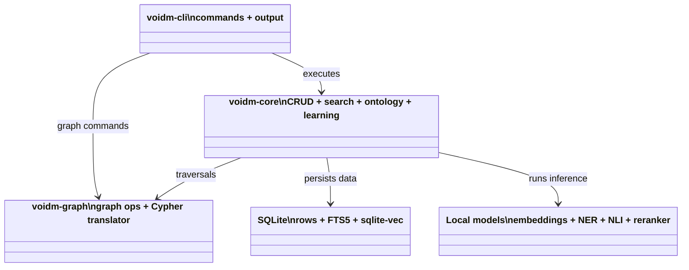

# voidm

Local-first persistent memory for LLM agents.

`voidm` is a Rust CLI that gives agents a durable memory layer: typed memories, hybrid retrieval, graph relationships, ontology concepts, and trajectory-informed learning tips, all stored locally.

This repository builds on the upstream project [autonomous-toaster/voidm](https://github.com/autonomous-toaster/voidm).

## What It Covers

- Typed memories for facts, procedures, decisions, events, and local context
- Local retrieval across vector, BM25, fuzzy, graph, and ontology signals
- A graph layer for linking memories and traversing relationships
- Ontology concepts, hierarchies, and contradiction handling
- Structured learning tips extracted from coding-agent trajectories
- Agent-friendly output via `--json` and `--agent`

## How It Fits Together



## Install

```bash
cargo install --path crates/voidm-cli
```

Rust 1.94.0 or newer is required. SQLite is bundled. Models are downloaded on first use.

Optional model warm-up:

```bash
voidm init
```

## Quick Start

```bash
voidm add "Postgres chosen for ACID guarantees" --type conceptual --scope work/acme
voidm search "database" --scope work/acme
voidm recall --scope work/acme --task "deployment"
voidm graph neighbors <memory-id> --depth 1
```

For agent-facing guidance:

```bash
voidm instructions
```

## Documentation

- [Documentation index](docs/index.md)
- [Concepts](docs/concepts.md)
- [CLI guide](docs/cli.md)
- [Configuration](docs/configuration.md)
- [Architecture](docs/architecture.md)
- [Development](docs/development.md)
- [Trajectory-informed learning layer](docs/TRAJECTORY_LEARNING_LAYER.md)

## Development

```bash
cargo check -p voidm-cli
cargo check -p voidm-core
cargo test -p voidm-cli
```

Contributor-facing details live in [docs/development.md](docs/development.md).

## Acknowledgements

Thanks to the original author of [autonomous-toaster/voidm](https://github.com/autonomous-toaster/voidm) for building and sharing the upstream project.

Inspired by [byteowlz/mmry](https://github.com/byteowlz/mmry) and [colliery-io/graphqlite](https://github.com/colliery-io/graphqlite).

RRF signal fusion in the search layer was informed by [QMD](https://github.com/tobil/qmd).

## License

MIT - see [LICENSE](LICENSE).
